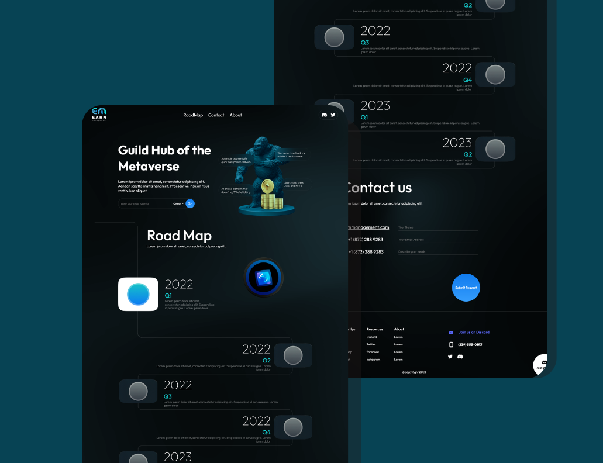

# Earn-Management

Earn-Maanagement is a web application built using React. It aims to provide users with easy access to resources related to a certain subject (Fingertips). The application includes features such as a blog, roadmap, and contact information. Users can also connect with the community on Discord and social media platforms like Twitter, Facebook, and Instagram.

## Table of Contents
- [Installation](#installation)
- [Usage](#usage)
- [Technologies Used](#technologies-used)
- [Demo](#demo)
- [Contribute](#contribute)
- [Contact](#contact)

## Installation
To run the Earn-Maanagement project locally, follow these steps:

1. Clone the repository from GitHub.
2. Make sure you have Node.js and npm (Node Package Manager) installed on your system.
3. Navigate to the project directory using the command line/terminal.
4. Run `npm install` to install the required dependencies.
5. Run `npm start` to start the development server.
6. Open your web browser and navigate to `http://localhost:3000` to view the application.

## Usage
Once you have the application running, you can use the navigation bar to explore different sections of the application, such as Home, Roadmap, Contact, and About. You can also connect with the community on Discord and follow the project on Twitter for updates.

## Technologies Used
The Earn-Maanagement application is built using the following technologies:
- React
- styled-components

## Demo

## Contact
If you encounter any issues, have questions, or want to contribute to the project, feel free to reach out
Enjoy using Earn-Maanagement and happy coding! 🚀

## Contribute
We welcome contributions from the community! If you find any bugs, have feature suggestions, or want to improve the application, please feel free to open an issue or submit a pull request. We value and appreciate your contributions.
